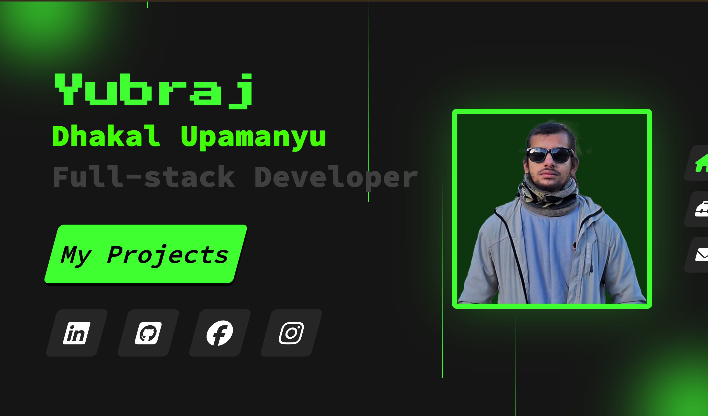

# 🧑‍💻 Yubraj Dhakal Upamanyu
# Coder-Protofolio

### 🚀 Full-stack Developer

Welcome to my personal portfolio repository!  
I'm **Yubraj Dhakal** a.k.a. **Upamanyu**, a passionate full-stack developer building clean, modern, and user-friendly websites and applications.

---

## 📸 Screenshot

  
<sup><sub>Replace this with an actual screenshot from your portfolio directory.</sub></sup>

---

## 🌐 Connect With Me

- 🔵 [**Facebook** – Yubraj Dhakal Upamanyu](https://www.facebook.com/profile.php?id=100091594880714)
- 🔗 [**LinkedIn** – Yubraj (UPAMANYU) Dhakal](https://www.linkedin.com/in/yubraj-dhakal-3b263428a/)
- 🐱 [**GitHub** – Upamanyu-coder](https://github.com/Upamanyu-coder)
- 📸 [**Instagram** – @yubraj__dhakal](https://www.instagram.com/yubraj__dhakal)

---

## 🧰 Tech Stack


---

## 📁 Project Structure

```bash
/
├── index.html           # Main HTML file
├── style.css            # Styling (CSS)
├── scripts/             # JavaScript logic (if separated)
├── photo/               # Images including team and screenshot
├── README.md            # This file

